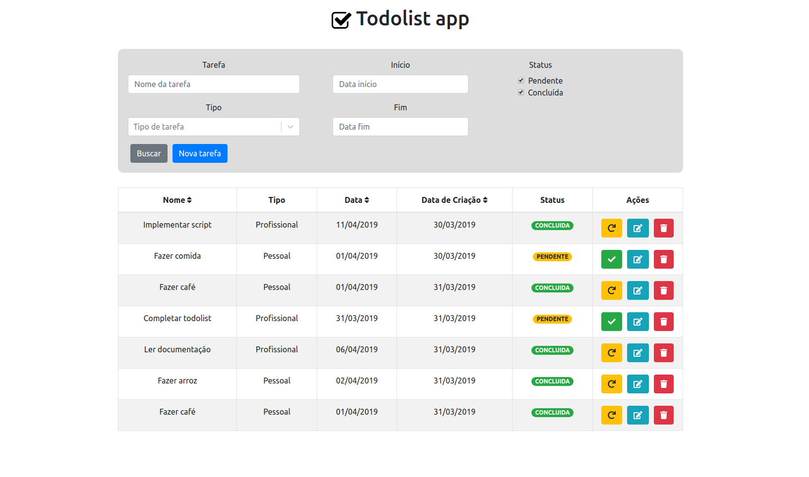

# Todolist

A aplicação foi desenvolvida inteiramente em Javascript, NodeJS na parte backend e ReactJS na parte frontend. O banco de dados utilizado foi o MongoDB conteinerizado com Docker e todo o sistema se encontra hospedado em um EC2 nos servidores da Amazon.

Aplicação em execução no ambiente de desenvolvimento.
<p align="center">
  
</p>

## Pré-requisitos

Primeiro, é necessário instalar a última versão do **node** e do **npm**, podemos fazer isso de forma simples através do **nvm** (node version manager). Apenas siga o tutorial disponível no site da nodesource: [Installing Node.js Tutorial: Using nvm](https://nodesource.com/blog/installing-node-js-tutorial-using-nvm-on-mac-os-x-and-ubuntu/).

Em seguida, precisamos instalar o Docker para poder executar uma instância do MongoDB de maneira simples. [Tutorial de instalação no site oficial](https://docs.docker.com/install/).

## Executando a aplicação

### Instruções para o Backend

Primeiramente, verifique que o docker está rodando em sua máquina e execute o container do MongoDB com o script `src/docker/mongodb.sh`.

Em seguida, mude para diretório `src/todolist-back` e execute o seguinte comando para instalar as dependências do servidor.

```
yarn install
```

Inicie o servidor backend da aplicação.

```
yarn start
```

Para rodar os testes da API, execute o comando a seguir. Detalhe: para executar os testes o servidor precisa estar em execução!

```
yarn test
```

### Instruções para o Frontend

Com o servidor em execução, mude para o diretório `src/todolist-front` e instale as dependências do frontend.

```
yarn install
```

Inicie o frontend da aplicação.

```
yarn start
```